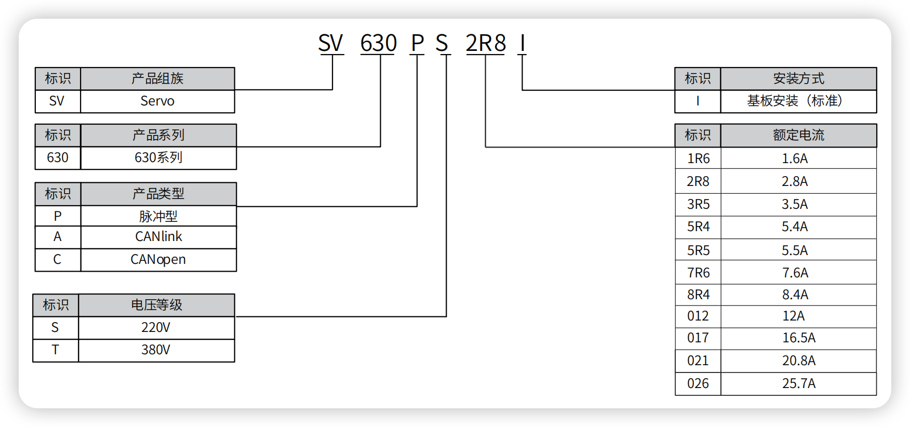

# 🚀 产品型号解析器

[](https://www.python.org/)
[](LICENSE)
[](https://github.com/psf/black)

> 一个可扩展的产品型号解析框架，支持多厂商、多规则，自动加载解析规则，支持 CLI 和 API 两种使用方式。

## ✨ 主要特性

- 🔌 **插件化架构**：新增解析器只需添加一个 `.py` 文件，无需修改核心代码
- 🚀 **动态加载**：运行时自动发现和加载 `parsers/` 目录下的解析规则
- 📊 **多格式输出**：支持表格（`table`）和 JSON（`json`）两种输出格式
- 🎯 **智能识别**：每个解析器实现 `detect()` 和 `parse()` 方法，自动匹配型号
- 🐳 **Docker 支持**：提供完整的容器化部署方案
- 🌐 **API 服务**：内置 FastAPI 服务，支持 HTTP 调用
- 💻 **CLI 工具**：命令行工具，支持批量解析和离线使用

## 📁 项目结构

```
product_parse/
├── 📄 parser_core.py        # 核心解析逻辑
├── 🌐 api_server.py         # FastAPI API 服务
├── 💻 cli.py                # 命令行工具
├── 📦 requirements.txt      # Python 依赖
├── 🐳 Dockerfile            # Docker 构建文件
├── 📚 README.md             # 项目文档
└── 🔌 parsers/              # 解析器插件目录
    ├── xyz100.py            # XYZ100 变频器解析器
    ├── sv630p.py            # SV630 伺服驱动器解析器
    ├── motor_ac.py          # 交流电机解析器
    ├── plc_ab200.py         # PLC AB200 解析器
    └── sensor_tx.py         # TX 传感器解析器
```

## 🚀 快速开始

### 环境要求

- **Python**: 3.10+
- **操作系统**: Windows / macOS / Linux

### 安装

```bash
# 克隆仓库
git clone https://github.com/yourusername/product_parse.git
cd product_parse

# 安装依赖（可选）
pip install -r requirements.txt
```

### 基本使用

```bash
# 使用内置示例型号
python3 cli.py --format table

# 解析指定型号
python3 cli.py --format table --models SV630PS2R8I XY1A-220-05KW-F

# JSON 格式输出
python3 cli.py --format json --models SV630PS2R8I
```

## 📊 使用示例

### 表格输出模式

```bash
python3 cli.py --format table --models SV630PS2R8I XY1A-220-05KW-F AC-M-2KW-1500-90 AB200-IO032 TX-PT-10K-V1
```

**输出结果：**

| 型号 | 产品组族 | 产品系列 | 产品类型 | 电压等级 | 额定电流 | 安装方式 | 系列 | 类型 | 电压 | 功率 | 功能 | 额定功率 | 额定转速 | 机座号 | I/O点数 | 通信接口 | 测量类型 | 量程 | 版本 |
|------|----------|----------|----------|----------|----------|----------|------|------|------|------|------|----------|----------|--------|---------|----------|----------|------|------|
| SV630PS2R8I | Servo | 630 | 脉冲型 | 220V | 2.8A | 基板标准 | | | | | | | | | | | | | | |
| XY1A-220-05KW-F | | | | | | | XYZ100 | 脉冲 | 220 | 05KW | F | | | | | | | | | |
| AC-M-2KW-1500-90 | | | | | | | AC电机 | | | | | M | 2KW | 1500 | | | | | | |
| AB200-IO032 | | | | | | | PLC AB200 | | | | | | | | 032 | 串口 | | | | |
| TX-PT-10K-V1 | | | | | | | TX传感器 | | | | | | | | | | PT | 10K | V1 |

### JSON 输出模式

```bash
python3 cli.py --format json --models SV630PS2R8I XY1A-220-05KW-F
```

**输出结果：**

```json
[
  {
    "型号": "SV630PS2R8I",
    "产品组族": "Servo",
    "产品系列": "630",
    "产品类型": "脉冲型",
    "电压等级": "220V",
    "额定电流": "2.8A",
    "安装方式": "基板标准"
  },
  {
    "型号": "XY1A-220-05KW-F",
    "系列": "XYZ100",
    "类型": "脉冲",
    "电压": "220",
    "功率": "05KW",
    "功能": "F"
  }
]
```

### 驱动器型号与铭牌示例


## 🔌 解析器说明

### 现有解析器

| 解析器 | 支持型号 | 主要字段 |
|--------|----------|----------|
| `sv630p.py` | SV630* | 产品组族、产品系列、产品类型、电压等级、额定电流、安装方式 |
| `xyz100.py` | XY1A*, XY1B* | 系列、类型、电压、功率、功能 |
| `motor_ac.py` | AC-M* | 系列、额定功率、额定转速、机座号 |
| `plc_ab200.py` | AB200* | 系列、I/O点数、通信接口 |
| `sensor_tx.py` | TX* | 系列、测量类型、量程、版本 |

### 编写新解析器

在 `parsers/` 目录下创建新的解析器文件，例如 `abc900.py`：

```python
def detect(model: str) -> bool:
    """检测是否为 ABC900 系列产品"""
    return model.startswith("ABC900")

def parse(model: str) -> dict[str, str]:
    """解析型号并返回字段字典"""
    return {
        "型号": model,
        "系列": "ABC900",
        "类型": "自定义类型"
    }
```

**重要说明：**
- 文件名必须以 `.py` 结尾
- 不能以下划线开头
- 必须实现 `detect()` 和 `parse()` 两个函数
- 保存后无需重启，系统会自动加载

## 🌐 API 服务

### 启动服务

```bash
# 使用 uvicorn 启动
uvicorn api_server:app --reload --port 8000

# 或使用 Python 直接运行
python3 api_server.py
```

### API 端点

| 方法 | 端点 | 描述 | 请求体 |
|------|------|------|--------|
| `GET` | `/health` | 健康检查 | - |
| `POST` | `/parse/single` | 解析单个型号 | `{"model": "SV630PS2R8I"}` |
| `POST` | `/parse/batch` | 批量解析型号 | `{"models": ["SV630PS2R8I", "XY1A-220-05KW-F"]}` |

### 调用示例

```bash
# 健康检查
curl http://127.0.0.1:8000/health

# 解析单个型号
curl -X POST http://127.0.0.1:8000/parse/single \
     -H "Content-Type: application/json" \
     -d '{"model": "SV630PS2R8I"}'

# 批量解析
curl -X POST http://127.0.0.1:8000/parse/batch \
     -H "Content-Type: application/json" \
     -d '{"models": ["SV630PS2R8I", "XY1A-220-05KW-F"]}'
```

## 🐳 Docker 部署

### 构建镜像

```bash
docker build -t product-parser .
```

### 运行服务

```bash
# API 模式
docker run -d --name product-parser-api -p 8000:8000 product-parser

# CLI 模式
docker run --rm product-parser python cli.py SV630PS2R8I --format json
```

### TODO
- 自动热加载功能
自动监控挂载目录改动并自动重载规则的功能，这样就连 docker restart 都不用，文件一保存 API 自动加载新规则。

## 🔧 开发指南

### 代码结构

- **`parser_core.py`**: 核心解析逻辑，包含解析器加载、型号检测、结果格式化等功能
- **`api_server.py`**: FastAPI 服务，提供 HTTP 接口
- **`cli.py`**: 命令行工具，支持批量解析和多种输出格式
- **`parsers/`**: 解析器插件目录，每个文件对应一个厂商或产品系列的解析规则

### 扩展解析器

1. 在 `parsers/` 目录下创建新的 `.py` 文件
2. 实现 `detect(model: str) -> bool` 函数，用于识别型号
3. 实现 `parse(model: str) -> dict[str, str]` 函数，用于解析字段
4. 保存文件，系统会自动加载新解析器

### 测试新解析器

```bash
# 测试单个型号
python3 cli.py --models YOUR_NEW_MODEL

# 测试批量型号
python3 cli.py --format table --models MODEL1 MODEL2 MODEL3
```

## ❓ 常见问题

### Q: 新增解析器后不生效？
**A**: 检查以下几点：
- 文件名是否以 `.py` 结尾
- 文件名是否以下划线开头
- 是否实现了 `detect()` 和 `parse()` 函数
- 函数签名是否正确

### Q: 表格列顺序不一致？
**A**: 表格列顺序由首次出现字段的顺序决定，这是正常行为。如需固定顺序，可以在解析器中统一字段顺序。

### Q: JSON 中文显示为 Unicode？
**A**: 系统已设置 `ensure_ascii=False`，中文会正常显示。如果仍有问题，请检查终端编码设置。

### Q: 如何调试解析器？
**A**: 可以使用以下方法：
- 在解析器中添加 `print()` 语句
- 使用 `--format json` 查看详细输出
- 检查 `detect()` 函数的返回值

## 📝 变更日志

### [v1.0.0] - 2025-08-27
- 🎉 初始版本发布
- 🔌 支持 5 种产品类型解析器
- 🌐 提供 CLI 和 API 两种使用方式
- ✨ 新增解析器支持
- 🔧 优化表格输出格式
- 📚 完善文档和示例

## 🤝 贡献指南

我们欢迎所有形式的贡献！

### 如何贡献

1. **Fork** 本仓库
2. **创建** 功能分支 (`git checkout -b feature/AmazingFeature`)
3. **提交** 更改 (`git commit -m 'Add some AmazingFeature'`)
4. **推送** 到分支 (`git push origin feature/AmazingFeature`)
5. **创建** Pull Request

### 贡献类型

- 🐛 Bug 修复
- ✨ 新功能
- 📚 文档改进
- 🔧 代码优化
- 🧪 测试用例

## 📄 许可证

本项目采用 [MIT](LICENSE) 许可证 - 查看 [LICENSE](LICENSE) 文件了解详情。

## 🙏 致谢

感谢所有为这个项目做出贡献的开发者！

---

<div align="center">

**如果这个项目对你有帮助，请给它一个 ⭐️**

</div>

